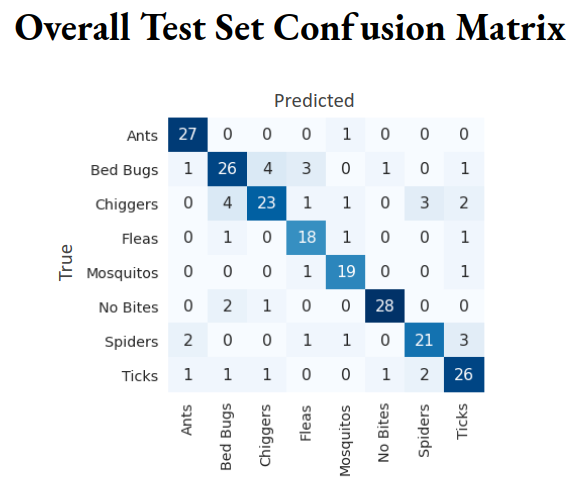

# BugBite ID

* Description:
    * An web application to help you identify what bugs bite you through an image of your bug bite and suggests bug-based and situation-based products and pest control companies.

* Types of bug bites that this web application can identify:
    * Ants
    * Bed Bugs
    * Chiggers
    * Fleas
    * Mosquitos
    * No Bites
    * Spiders
    * Ticks

* This Web application is based on a TF Keras model that used transfer learning from <a href="https://arxiv.org/abs/1512.00567">Inception v3 model</a> for bug bite classification
    * ~1300 total images across 8 categories are collected
    * Images are cropped and augmented before feeding into the pre-trained Inception v3 model
    * Only the last ~1/3 of the layers were unfreeze for training to adapt the model for bug bite classification

# Accuracy and Performance
* **81% accuracy** for a 8 class classification on the overall testing set
* Recall, precision, and f1-score are also 81% since the classes are balanced

* Limitations:
    * Although no bites (normal skin) images are included in the model, this model cannot recognize non-skin images (e.g. car image, image of texts, etc) as non-bugbite images and would randomly assign a class to the image
    * Training dataset is biased in terms of skin tone diversity: severe lack of darker skin tone
        * This leads to poor accuracy on a seperated and limited test set of skin of color
# Folders

* [Flask_app](./Flask_app):
    * bugbiteID- the Flask app to identify bugbite based on an image and provide bug-specific, symtom-specific information
    * TF Keras model is loaded in the [model.py](./Flask_app/bugbiteID/model.py) file, change the file path to the path of the model:
        * To download the TF Keras model, click <a href="https://drive.google.com/file/d/1XYy3ltdV0zzBVYRU2ggnp4MsNvnlWriX/view?usp=sharing">here</a>
    * To run the Flask app, run [app.py](./Flask_app/bugbiteID/app.py)

* [Resources](./Resources) :
    * contains Jupyter notebooks for web scraping for images, products, and pest control companies and for making SQLite database
    * folders:
        * cropped: contains all the images used for training and validation in their inidividual folders
        * webpage_resources: csv files containing information about products, bug bite information, etc for making the SQLite databases

* [Simple_models](./Simple_models):
    * Jupyter notebooks for training simple Logistic Regression and CNN model for bug bite image classification

* [TensorFlow_Keras_LIME](./TensorfFlow_Keras_LIME): 
    * Jupyter notebooks for training and saving TF Keras model, looking at misidentifications, visualizing intermediate layers, and explaining the classication through LIME

* [Measurement_Metrics_Images](.Measurement_Metrics_Images)
    * Contains images of confusion matric and improvement in accuracy for different models